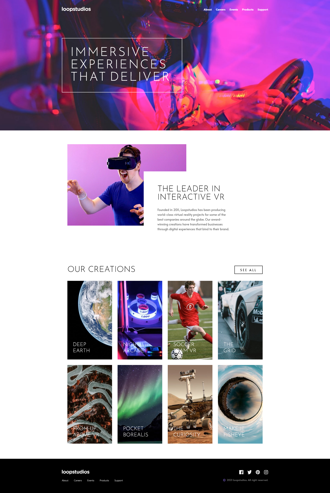
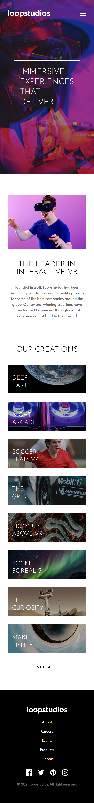

# Frontend Mentor - Loopstudios landing page solution

This is a solution to the [Loopstudios landing page challenge on Frontend Mentor](https://www.frontendmentor.io/challenges/loopstudios-landing-page-N88J5Onjw). Frontend Mentor challenges help you improve your coding skills by building realistic projects.

## Overview

### The challenge

Users should be able to:

- View the optimal layout for the site depending on their device's screen size
- See hover states for all interactive elements on the page

### Screenshots

Desktop

Mobile

Desktop

### Links

- Solution URL: [https://www.frontendmentor.io/solutions/loopstudios-XHbnCShO\_\_](https://www.frontendmentor.io/solutions/loopstudios-XHbnCShO__)
- Live Site URL: [https://dev-paull.github.io/loopstudios-landingpage-react/](https://dev-paull.github.io/loopstudios-landingpage-react/)

## My process

- 📸 Analyzed screenshots: identified the different components, layout differences between mobile and desktop
- 🎨 Integrated styles (colors & fonts)
- 📱 Mobile-first
- 🖥️ Desktop adaptation
- ✨ Active states, transitions & animations
- 🔧 Fixes and polishing

### Built with

- Semantic HTML, React, Typescript, Framer-motion, TailwindCSS, ViteJS
